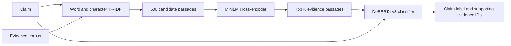

# Two-Stage Evidence Retrieval and Transformer-Based Claim Verification

[](https://github.com/liangyuchen-research/evidence-retrieval-claim-verification/actions/workflows/checks.yml)

A retrieval and classification pipeline for checking claims against
**1,208,827 evidence passages**, developed for Natural Language Processing
at the University of Melbourne.

**Source code:** [Pipeline notebook](notebooks/claim_verification.ipynb) · [Offline validation](scripts/check_notebook.py) · [Dependencies](requirements.txt)

The implementation is provided as a Jupyter notebook, including candidate
retrieval, cross-encoder reranking, classifier training, evaluation, and prediction
export. Dataset files and pretrained model weights are separate dependencies.

The system first retrieves candidate evidence with word and character TF-IDF,
reranks the candidates with a MiniLM cross-encoder, and classifies each claim
with a fine-tuned DeBERTa-v3 model. Word and character features provide broad
candidate coverage, while the cross-encoder scores claim-passage relevance
before classification.

## Pipeline



| Component | Implementation |
| --- | --- |
| Candidate retrieval | Weighted word unigrams/bigrams and character 3-5-grams |
| Candidate pool | 500 passages per claim |
| Reranking | `cross-encoder/ms-marco-MiniLM-L6-v2` |
| Evidence selection | K = 3, chosen from K = 2–7 by development retrieval F1 |
| Classification | `microsoft/deberta-v3-base`, class-weighted cross-entropy |
| Labels | Supports, refutes, not enough information, disputed |
| Tools | PyTorch, Hugging Face Transformers, scikit-learn, SciPy |

## Recorded results

| Development metric | Recorded value |
| --- | ---: |
| Top-500 candidate hit rate | 88.96% (137 of 154 claims) |
| Mean gold-evidence recall in the candidate pool | 62.08% |
| End-to-end claim accuracy with retrieved evidence | 51.30% |
| End-to-end evidence F1 | 19.51% |

Hit rate measures whether at least one reference passage appears among the
500 candidates. It is distinct from claim accuracy. These results come from
the saved submission run. The development set was used to select evidence
depth and classifier checkpoints, and training has not been repeated for this
release. [Evaluation notes](docs/evaluation.md) include the baseline comparison
and the separate gold-evidence classification results.

## Run locally

Use a separate Python environment and install a PyTorch build appropriate for
your hardware. From the repository root:

```bash
python -m pip install -r requirements.txt
python scripts/check_notebook.py
jupyter lab notebooks/claim_verification.ipynb
```

Place the dataset files described in [data/README.md](data/README.md), review
the configuration cell, and run the notebook cells in order. Package installation
inside the notebook is disabled by default.

The notebook resolves paths from the repository or its `notebooks/` directory.
`CLAIM_PROJECT_ROOT` can override that root. `CLAIM_DATA_DIR` and
`CLAIM_ARTIFACT_DIR` select separate input and output directories. Large matrices,
predictions and checkpoints default to the ignored `artifacts/` directory. Downloading data
and training the optional final train+development classifier require explicit
configuration switches. The default workflow still includes expensive index
construction and classifier training.

The full evidence index requires substantial host memory and disk space, and
classifier training benefits from a GPU. Model weights and the source corpus
are external dependencies. The requirements file gives dependency ranges rather
than an exact lock of the original environment. `constraints-tested.txt` records
the Python 3.12 versions used for the maintenance checks and can be supplied with
`pip install -r requirements.txt -c constraints-tested.txt`.

## Repository contents

- `notebooks/claim_verification.ipynb`: retrieval, training and evaluation.
- `docs/evaluation.md`: metric definitions and limitations.
- `docs/provenance.md`: source and maintenance notes.
- `data/README.md`: input schema and source links.
- `scripts/check_notebook.py`: notebook validation and synthetic regression checks.
- `scripts/check_retrieval.py`: actual TF-IDF indexing and cache checks on synthetic passages.
- `scripts/check_trainer.py`: local DeBERTa/Trainer compatibility check without downloaded weights.

Run `python scripts/check_notebook.py` for local checks without downloading
models or running training. Notebook schema validation additionally uses
`nbformat` when installed.

For numerical retrieval and training API checks, run:

```bash
python scripts/check_retrieval.py
python scripts/check_trainer.py
```

The trainer check uses a tiny randomly initialized DeBERTa encoder and four
synthetic examples. It tests one CPU optimizer step, evaluation, prediction,
checkpoint export and reload. It is a software check, not a reproduction of
the reported experiment. Transformers is bounded below version 5 to avoid
unreviewed major API changes.

## Attribution and reuse

Developed as **Team 32, Natural Language Processing, 2026** at the University
of Melbourne. My part of the project was the retrieval and modelling pipeline in
this notebook: the word- and character-level TF-IDF index over the 1.2M-passage
corpus and its top-500 candidate retrieval, the cross-encoder reranking and the
selection of K = 3 evidence passages, and the class-weighted fine-tuning of the
DeBERTa-v3 classifier. The implementation is maintained here by Liang-Yu Chen.
See [NOTICE.md](NOTICE.md) for third-party model and data attribution.
