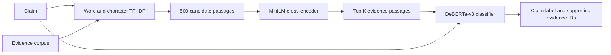

# Two-Stage Evidence Retrieval and Transformer-Based Claim Verification

A notebook implementation of evidence retrieval and claim verification over
**1,208,827 passages**, developed for Natural Language Processing at the
University of Melbourne.

The system first retrieves candidate evidence with word and character TF-IDF,
reranks the candidates with a MiniLM cross-encoder, and classifies each claim
with a fine-tuned DeBERTa-v3 model. The two-stage title describes retrieval;
classification is the third stage of the complete pipeline.

## Pipeline

| Component | Implementation |
| --- | --- |
| Candidate retrieval | Weighted word unigrams/bigrams and character 3-5-grams |
| Candidate pool | 500 passages per claim |
| Reranking | `cross-encoder/ms-marco-MiniLM-L6-v2` |
| Evidence selection | K = 2-7, selected using development retrieval F1 |
| Classification | `microsoft/deberta-v3-base`, class-weighted cross-entropy |
| Labels | Supports, refutes, not enough information, disputed |
| Tools | PyTorch, Hugging Face Transformers, scikit-learn, SciPy |

## Recorded results

The source notebook records **88.96% top-500 hit rate** on 154 development
claims: at least one gold evidence passage occurs in the candidate pool for
137 claims. This is a candidate-retrieval metric, not end-to-end classification
accuracy. Its mean gold-evidence recall is 62.08%.

The same recorded notebook run has 51.30% end-to-end development claim accuracy
with retrieved evidence and 19.51% evidence F1. Model and evidence-depth selection
used the development set, so these are development results, not held-out test
performance. See [evaluation notes](docs/evaluation.md) for the full context,
baseline comparison, run differences, and train+development evaluation caveat.

## Run locally

1. Use a Python environment with the dependencies in `requirements.txt`.
2. Install the appropriate PyTorch build for the available hardware, then run
   `python -m pip install -r requirements.txt`.
3. Obtain the source dataset as described in [data/README.md](data/README.md).
4. Run `jupyter lab` from this repository and open
   `notebooks/claim_verification.ipynb`.
5. Review the configuration cell and run cells in order.

The notebook resolves paths from the repository or its `notebooks/` directory.
`CLAIM_PROJECT_ROOT` can override that root. Large matrices, predictions and
checkpoints are written to the ignored `artifacts/` directory. Downloading data
and training the optional final train+development classifier require explicit
configuration switches. The default workflow still includes expensive index
construction and classifier training.

The original run used a Colab T4 GPU. The full evidence index requires substantial
host memory and disk space. No model weights or source corpus are bundled.
Dependency ranges are not an exact environment lock, and full training has not
been rerun during repository preparation.

## Repository contents

- `notebooks/claim_verification.ipynb`: cleaned, output-free implementation.
- `docs/evaluation.md`: metric definitions and limitations.
- `docs/provenance.md`: source lineage and precise cleanup changes.
- `data/README.md`: input schema and source links.
- `scripts/check_notebook.py`: lightweight syntax, hygiene and metric checks.

Run `python scripts/check_notebook.py` for local checks without downloading
models or running training. Notebook schema validation additionally uses
`nbformat` when installed.

## Attribution and reuse

The original submission is labelled **Team 32, COMP90042, 2026**. This portfolio
copy was prepared for Liang-Yu Chen from the supplied submission archive.
See [NOTICE.md](NOTICE.md) for third-party model and data attribution.
No open-source license was supplied with the project, so this repository does
not assign a new license to the original work.
